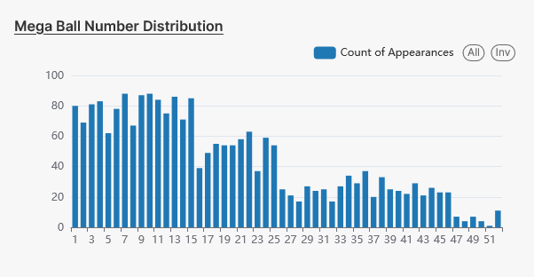

# Superset Investigation of NY Powerball Lottery numbers
#### Author: Sacrebleu, 2024

#### Prerequisites

1. Terraform 1.7.x
2. git
3. awscli
4. kubectl

#### Tl;Dr How to run

###### Precursors

    $ export AWS_ACCESS_KEY_ID=<access key>
    $ export AWS_SECRET_ACCESS_KEY=<secret key>

###### Initial Infrastructure Build - VPC, IAM, EKS cluster, Athena workspace and Glue data catalog

    $ cd ./tf
    $ terraform init
    $ terraform plan -out plan.out 
    $ terraform apply -plan plan.out

###### Helm application provisioning and IAM role for superset service account

Some values need to be set as locals e.g the cluster name and the oidc provider.  These could be derived with more work.

    $ cd ./helm
    $ terraform init
    $ terraform plan -out plan.out 
    $ terraform apply -plan plan.out

###### Post-terraform steps

Some manual configuration was necessary.

1.  There is a chicken and egg problem on the IAM roles for the superset user that I didn't have time to properly solve - namely, the kms key used for data encryption and decryption is created at eks cluster time, but the IAM role for the user is created as part of the helm setup.  It would probably be better to do IAM prior to infrastructure build but given that this was a problem that emerged while I was working on the demo, I didn't feel it was worth the time to go back and rearrange everything; the existing system is good enough for a POC.  

    Thus, the KMS key policy needs manual amendment to permit the superset athena role to make use of it and a reapplication of terraform will remove the policy block that grants the superuser role access to the relevant kms key.

2. Superset required a custom secret that was generated with openssl rand 16 -base64.  This would be more useful if it were generated automatically, but there would be a chance that it could be accidentally altered during a run; superset has a defined secret rotation process that this would then violate.

3. A superset user was manaully  created alongside the admin user.  This user has read access to the generated data dashboard
4. superset datasets and an aurora view were created manually via the superset ui.  Ideally these would be generated as part of the superset bootstrap process.

#### Superset Dataset Configuration

The initial data table is based on the csv file upload.  However, I created some derived fields which were then complex to visualise.  I took the decision to create a separate view for the combined winning ball numbers:

    CREATE OR REPLACE VIEW lottery_winning_numbers_merged AS
    select split_part(winning_numbers, ' ', 1) as num from lottery_numbers
    union all
    select split_part(winning_numbers, ' ', 2) as num from lottery_numbers
    union all
    select split_part(winning_numbers, ' ', 3) as num from lottery_numbers
    union all
    select split_part(winning_numbers, ' ', 4) as num from lottery_numbers
    union all
    select split_part(winning_numbers, ' ', 5) as num from lottery_numbers

this leverages sql to provide a unified list of numbers which are then more amenable
to counting, placing into histograms etcetera.

---

## Design decisions

#### 1. Wide-ranging roles were given to the project provisioning user

In a normal environment, I would have either used an IAM boundary policy or spent  more time locking down the roles for the terraform user, but I am not familiar enough with Glue and Athena to guess what roles will be needed and time is short.  Therefore I have in general used the AWS provisioned roles for service users where I could, and inline IAM policies elsewhere.  All are allocated via a user-group for ease of management

#### 2. EKS as a platform

I chose EKS because I have good experience with it in my day to day.  In the guise of what is being done here it is easy to reason about, there is limited use of more complex Kubernetes concepts, most of this project is Deployments, Ingresses etcetera.  EKS gives me a fast, responsive platform with rich tooling that I can use to investigate and debug issues; I am comfortable with it as my day-to-day environment.

#### 3. Helm is provisioned via terraform rather than argocd

Given the nature of the task, I took the decision to directly provision superset into the cluster with the terraform helm provider.  In general I'd prefer the cluster was running argocd so that I could use something like the terraform argo provider and defineargo apps that way.  This is good enough for a play system and gives a faster turn-around.

#### 4. File upload via terraform

Again, a real-world system would have some sort of data transform pipeline for feeding data - storing lottering numbers as a string array is not ideal.  I played with the idea of transforming the data before upload, but it wasn't clear whether that was permitted within the scope of the exercise and it would be quick to do if it became necessary.  Superset has transform functions which seem adequate on top of athena.  It's a pragmatic solution and it works well enough within the scope of the demo

###### 5. IAM roles should be provisioned prior to build-out

In an ideal world I would have a good overview of what roles were necessary and prune out those that were not.  Unfortunately, some of these services [Glue, Athena] are new to me so I'm not familiar with their required minimum credential sets.  Where possible.

I've retroactively gone back to prune down iam permissions etc.

###### 6. Use of Nginx Ingress

I elected to use the NginX ingress controller primarily because it provides a reliable manner to map k8s services to a classic loadbalancer (which is what is used in this case).  I use Ingresses in my day to day role and am comfortable enough with them to troubleshoot them if there are issues

###### 7. Postgresql should be in RDS, Redis should be in Elasticache

I don't like running stateful data stores in kubernetes - even with PVC backing and regional topology annotations. It makes more sense to me to keep data outside the cluster where possible, so I would prefer to put Postgresql and Redis into external services.  However, that is beyond the scope of this exercise and what is provided here is good enough for the small datasets in use.

#### Meditations

1. superset configuration required an enormous amount of trial and error; the internet is full of bad or subtly wrong config suggestions.  What worked was a service account using irsa with the necessary permissions and providing NO FURTHER GUIDANCE to the superset system about how to connect; boto3 used the assumed role and was able (finally) to connect.  In retrospect it's obvious but it was a journey of several hours to land on a working configuration.

2. Being unfamiliar with superset, it was frustrating to try to work out how to display data in the way I wanted to.  I think of things like lottery ball picks in terms of the basic statistics I know, so to me histograms and gaussian curves make sense.  However, visualising them took some work, it was only late in the demo that I worked out that bar charts could with some work be configured to behave like histograms.  The 'Winning number frequency chart' demonstrates this.

----

## Results

#### Statistics of the NY Lottery Dataset

###### 1: Select top 5 common winning numbers

query:

    select num, count(num) as freq
    from lottery_winning_numbers_merged
    group by num
    order by freq desc
    limit 5

results:

    #	num	freq
    1	31	217
    2	10	215
    3	20	211
    4	17	210
    5	14	210

###### 2: Calculate the Average Multiplier Value

query:

    select avg(cast(coalesce(nullif(multiplier,''),'0') as integer))
    from lottery_numbers

result:

    1.992948435434112

###### 3: Calculate the top 5 mega ball results

query:

    select count(mega_ball) as cnt, mega_ball
    from lottery_numbers
    group by mega_ball
    order by cnt desc
    limit 5

result:

    #	cnt	mega_ball
    1	88	10
    2	88	7
    3	87	9
    4	86	13
    5	85	15

###### 4. How many of the lotteries were drawn on a weekday vs weekend

weekday query:

    select count(*) from (
        select  case when day_of_week(date_parse(draw_date, '%m/%d/%Y')) > 5 then 0 else 1 end as d
        from lottery_numbers) as d
    where d = 1

    #	_col0
    1	2269

weekend query:

    select count(*) from (
    select  case when day_of_week(date_parse(draw_date, '%m/%d/%Y')) > 5 then 0 else 1 end as d
    from lottery_numbers) as d
    where d = 1

    #	_col0
    1	0

Result: all lotteries were run during the week (specifically on Tuesdays and Fridays)

#### Some interesting patterns I noticed

On the statistics themselves; ball 1, ball 5 and the mega ball all seem to display sample curves that seem suspicious at first glance.  

Ball 1 could be interpreted as a normal distribution that just happens to be skewed very heavily towards the lower end of the scale:

but ball 5 on the other hand has two distinct peaks - which seems anomalous in the context of the normal curve I'd expect. 

Even more strangely - the power ball is roughly twice as likely to be 20 or less than it is to be 21 or above.  

Finally, there's a noticeable taper towards the frequency of the upper numbers when all the balls are investigated simultaneously, with balls of value > 56 being noticeably under-represented in the overall dataset

It would be very interesting to see the result distributions for the data in the order of ball drawing, rather than sorted from smallest to largest as the dataset is currently sorted.  Perhaps there is some sort of bias which would be explained from that that is obscure from this ordered data.